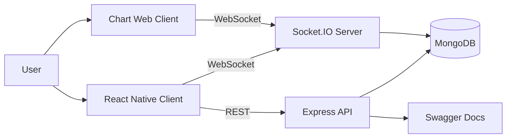

# Trading App

A modern, lightweight trading application built with React Native 0.83, Node.js, and React.js, featuring real-time trading capabilities with secure authentication mechanisms.


##  Features

###  Security
- **Solid 2FA Mechanism**: Two-factor authentication for enhanced security
- **PIN Lock**: Additional device-level security layer
- **Rate Limitation for OTP**: Prevention of brute-force attacks
- **SMTP Service**: Secure email delivery for notifications and OTP

###  Trading Features
- **Real-time Trading Simulation**: Live trading experience using Socket.io
- **Buy/Sell Operations**: Seamless trading execution
- **Lightweight TradingView Charts**: Efficient and responsive charting
- **Portfolio Management**: Track your investments in real-time

###  Technical Highlights
- **Cross-Platform**: Built with React Native for iOS and Android
- **Real-time Updates**: WebSocket connections for live data
- **Modern Stack**: Latest versions of Node.js and React.js
- **Optimized Performance**: Lightweight and fast performance
# Trading App


> A full-stack stock trading simulation built with React Native, Express, MongoDB, Socket.IO, and a dedicated lightweight chart experience.

## Project Overview

Trading App is a production-style trading simulation that combines mobile trading flows, secure authentication, live market updates, and a charting companion app. It is designed to demonstrate the kind of architecture recruiters look for in a modern fintech product: real-time data delivery, state persistence, multi-factor authentication, reusable UI layers, and clean separation between mobile, API, and market visualization concerns.

The repository contains three coordinated surfaces:

| Surface | Purpose | Tech |
| --- | --- | --- |
| Mobile client | Trading, onboarding, portfolio, and account flows | React Native, Redux Toolkit, MMKV, React Navigation |
| API server | Authentication, stock/order/holding APIs, socket gateway, persistence | Node.js, Express, MongoDB, Socket.IO |
| Chart client | Lightweight TradingView-style market visualization | React, lightweight-charts, Socket.IO |

## Key Features

- Secure onboarding with email OTP, login, refresh tokens, PIN setup, and biometric verification.
- OAuth support for Google and Apple sign-in.
- Real-time stock subscriptions through Socket.IO.
- Buy/sell order flows with holdings and order history tracking.
- Persisted application state using Redux Persist + MMKV.
- TradingView-inspired charting experience in a dedicated web client.
- In-memory MongoDB fallback for local development when a remote database is unavailable.
- Swagger documentation for the API surface.

## Project Architecture



### System Design / Workflow

1. The mobile client starts at the splash screen and routes users through authentication, profile setup, and trading screens.
2. The client persists user and theme state locally and refreshes tokens as needed.
3. REST endpoints handle auth, profile, stock, holding, and order operations.
4. The Socket.IO server pushes live stock updates to subscribed clients during trading hours.
5. The chart web app renders candlestick data and streams updates from the same realtime backend.

## Multi-Agent Architecture

No runtime multi-agent architecture is implemented in the product itself. The application uses a conventional client-server model with a realtime socket layer. If you are evaluating this repository from a hiring perspective, the strength is in the architectural separation of concerns rather than an autonomous agent workflow.

## Tech Stack

| Layer | Technologies |
| --- | --- |
| Mobile | React Native 0.81, React 19, TypeScript, React Navigation, Redux Toolkit, Redux Persist, MMKV |
| Backend | Node.js, Express, Socket.IO, Mongoose, JWT, Nodemailer, Swagger UI |
| Charts | React 18, lightweight-charts, Socket.IO client |
| Auth & Security | OTP verification, PIN lock, biometric auth, OAuth, refresh tokens |
| Data | MongoDB, in-memory MongoDB fallback |

## AI/LLM Technologies Used

No direct LLM or AI API integration is present in the current codebase. That is a deliberate strength for a trading product focused on reliability, determinism, and security. The architecture is, however, AI-ready if you later want to add features such as market summarization, support copilots, or intelligent alerts.

## Folder Structure

```text
trading_app/
├── client/                 # React Native mobile app
│   ├── App.tsx
│   ├── src/
│   │   ├── components/
│   │   ├── navigation/
│   │   ├── redux/
│   │   ├── screens/
│   │   ├── styles/
│   │   └── utils/
│   └── android/ ios/
├── server/                 # Express + Socket.IO API
│   ├── app.js
│   ├── controllers/
│   ├── middleware/
│   ├── models/
│   ├── routes/
│   ├── services/
│   └── docs/swagger.yaml
├── chart/                  # Web charting client
│   ├── src/App.js
│   ├── src/AppDemo.js
│   └── src/Utils.js
└── Readme.md
```

## Installation Guide

### Prerequisites

- Node.js 18 or later
- npm 9+ or Yarn
- React Native development environment for iOS/Android
- MongoDB Atlas or local MongoDB access
- Android Studio / Xcode if you want to run the mobile app on a device or simulator

### 1. Install dependencies

```bash
cd server
npm install

cd ../chart
npm install

cd ../client
npm install
```

### 2. Configure environment files

Create a `.env` file in `server/` and set the client constants in `client/src/config/env.tsx` plus the endpoint constants in `client/src/redux/API.tsx` if you are not using the default local values.

### 3. Seed data, if needed

```bash
cd server
npm run seed
```

## Environment Variables

### Server `.env`

| Variable | Purpose | Example |
| --- | --- | --- |
| `MONGO_URI` | MongoDB connection string | `mongodb+srv://...` |
| `PORT` | REST API port | `3000` |
| `SOCKET_PORT` | Socket.IO server port | `4000` |
| `WEBSERVER_URI` | Allowed websocket origin | `http://localhost:3001` |
| `JWT_SECRET` | Access token signing secret | `your_secret` |
| `REFRESH_TOKEN_SECRET` | Refresh token signing secret | `your_secret` |
| `SOCKET_TOKEN_SECRET` | Socket auth secret | `your_secret` |
| `EMAIL_SERVICE` | SMTP provider name | `gmail` |
| `EMAIL_USER` | SMTP sender address | `name@example.com` |
| `EMAIL_PASS` | SMTP app password | `********` |

### Client config

| File | Setting | Purpose |
| --- | --- | --- |
| `client/src/config/env.tsx` | `GOOGLE_CLIENT_ID`, `IOS_GOOGLE_CLIENT_ID`, `WEB_CLIENT_ID` | Google Sign-In configuration |
| `client/src/redux/API.tsx` | `BASE_URL`, `SOCKET_URL`, `TRADINGVIEW_WEB_URI` | API, socket, and chart endpoints |

## Running the Project

### Backend API and socket server

```bash
cd server
npm run dev
```

The server runs the REST API and the socket service, typically on ports `3000` and `4000` respectively.

### Chart web app

```bash
cd chart
npm start
```

The chart client starts on port `3001` by default.

### React Native mobile app

```bash
cd client
npm install
npm run ios
```

On Windows or Android:

```bash
cd client
npm run android
```

### iOS pods

```bash
cd client/ios
pod install
```

## API Endpoints

### Authentication

| Method | Endpoint | Purpose |
| --- | --- | --- |
| POST | `/auth/check-email` | Check if a user exists and trigger OTP flow |
| POST | `/auth/register` | Register a new user |
| POST | `/auth/login` | Authenticate with email and password |
| POST | `/auth/refresh-token` | Refresh access token |
| POST | `/auth/logout` | Logout the current user |
| POST | `/auth/oauth` | OAuth login |
| POST | `/auth/send-otp` | Send OTP to email |
| POST | `/auth/verify-otp` | Verify OTP |
| GET | `/auth/profile` | Fetch profile data |
| PUT | `/auth/profile` | Update profile data |
| POST | `/auth/set-pin` | Set login PIN |
| POST | `/auth/verify-pin` | Verify PIN |
| POST | `/auth/upload-biometric` | Store biometric key |
| POST | `/auth/verify-biometric` | Verify biometric key |

### Trading

| Method | Endpoint | Purpose |
| --- | --- | --- |
| GET | `/stocks` | Fetch all stocks |
| GET | `/stocks/stock` | Fetch stock by symbol |
| POST | `/stocks/register` | Register a stock record |
| POST | `/stocks/buy` | Buy stock |
| POST | `/stocks/sell` | Sell stock |
| GET | `/stocks/order` | Fetch orders |
| GET | `/stocks/holding` | Fetch holdings |

### Socket events

| Event | Direction | Purpose |
| --- | --- | --- |
| `subscribeToStocks` | Client -> Server | Subscribe to a single symbol |
| `subscribeToMultipleStocks` | Client -> Server | Subscribe to multiple symbols |
| `<SYMBOL>` | Server -> Client | Receive live updates for a specific stock |
| `multipleStocksData` | Server -> Client | Receive batch market data |

## Screenshots

### Mobile App

_Placeholder for login, dashboard, portfolio, and transaction screenshots._

### Chart Web App

_Placeholder for candlestick chart and realtime market update screenshots._

## Future Improvements

- Add watchlists, price alerts, and push notifications.
- Introduce analytics dashboards for portfolio performance.
- Expand order types such as limit, stop-loss, and bracket orders.
- Add test coverage for critical auth and trading flows.
- Containerize services and add CI/CD pipelines.
- Add optional AI assistants for portfolio summarization or support queries.

## Challenges Solved

- Coordinating a mobile app, socket server, and charting client around one realtime backend.
- Keeping authentication secure with OTP, PIN, biometric, OAuth, and token refresh flows.
- Handling live market data without degrading mobile UX.
- Supporting local development even when MongoDB Atlas is unavailable by falling back to an in-memory database.

## Learning Outcomes

- Building a layered fintech-style architecture with clear separation of concerns.
- Implementing state persistence and secure client storage in React Native.
- Designing socket-based realtime subscriptions alongside REST APIs.
- Working with MongoDB models, auth flows, and operational fallback strategies.

## Why This Project Stands Out

- It is not just a UI clone; it demonstrates end-to-end product engineering across mobile, backend, and realtime data visualization.
- The codebase addresses common fintech concerns such as authentication hardening, session refresh, and secure account setup.
- The chart experience and socket-driven updates make the project feel closer to a real market terminal than a static demo.
- The repository shows practical architecture decisions that are useful in interviews and on a portfolio page.

## License

This project is licensed under the ISC License. See the source files and package metadata for details.


